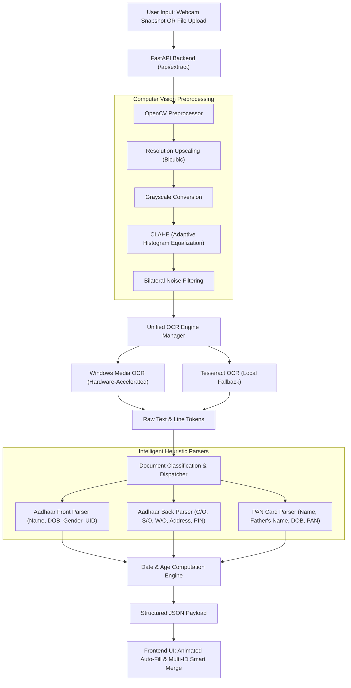

# 🚀 Quick Fill (QF) - Intelligent ID Form Auto-Filler

> **Course**: 2nd Year Mini Project - Modern Programming Language (MPL - Python)  
> **Domain**: Computer Vision, Optical Character Recognition (OCR), Automation & Full-Stack Python

---

## 📌 Executive Summary
**Quick Fill (QF)** is an automated KYC and form-filling application designed to eliminate repetitive, error-prone manual data entry from Indian Government Identity Documents (**UIDAI Aadhaar Card** and **Income Tax PAN Card**).

By simply uploading an ID image or capturing it live via a webcam, QF processes the document through an OpenCV enhancement pipeline, extracts the text using hardware-accelerated local OCR, intelligently classifies the card type, and auto-populates the form with:
- **Cardholder Name**
- **Date of Birth (DOB)** and **Exact Calculated Age** (years and months)
- **Father / Spouse / Guardian Name** (from `C/O`, `S/O`, `W/O`, `D/O`, or PAN `Father's Name`)
- **Full Residential Address** with detected State and 6-digit PIN code
- **Document Identification Number** (Aadhaar / PAN) & **Gender**

---

## 💡 Tech Question: OCR vs. Alternatives (Analysis for Mini Project)

The core challenge in automated document extraction is choosing the right extraction paradigm:

| Criteria | 1. Traditional OCR + Regex (Our Primary) | 2. Multimodal Vision AI (Gemini 1.5 / GPT-4o) | 3. Cloud Vision APIs (Google Cloud / AWS Textract) |
| :--- | :--- | :--- | :--- |
| **Data Privacy** | **100% Offline & Private** (zero data leaves the device) | Requires sending sensitive PII to cloud servers | Sends sensitive PII to external third-party APIs |
| **Cost** | **100% Free** (No subscription or API billing) | Pay-per-token API fees | Monthly / per-page API billing |
| **Internet Dependency** | **Zero** (Runs in air-gapped / offline environments) | Requires high-speed internet connection | Requires high-speed internet connection |
| **Inference Latency** | **Fast** (~100ms - 400ms on local CPU/GPU) | Higher (~1.5s - 3.5s network round-trip) | Moderate (~800ms - 2s) |
| **Noisy / Tilted Photos** | Handled via OpenCV (CLAHE, Bilateral filtering, Deskew) | Extremely high out-of-the-box accuracy | High accuracy |
| **Academic Merit (MPL)** | **Demonstrates CV, Algorithms, Regex, OOP, & Async Python** | Only demonstrates a basic REST API wrapper | Basic SDK usage |

### Why QF uses a Hybrid Architecture:
1. **Core Engine**: Uses Python's native Windows Media OCR (`winocr`) and Tesseract with OpenCV computer vision preprocessing. This ensures zero-cost, 100% privacy compliance for sensitive national IDs (Aadhaar/PAN), and showcases core Computer Vision and Python engineering skills for MPL evaluation.
2. **Extensible AI Fallback**: The architecture is decoupled so a Multimodal Vision model (such as Gemini 1.5 Flash Vision) can be plugged in as an optional secondary engine.

---

## 🏗️ System Architecture



---

## 📂 Project Directory Structure

```
e:\Codes\OCR/
│
├── backend/
│   ├── __init__.py
│   ├── main.py                 # FastAPI application routes & static file serving
│   ├── ocr_engine.py           # Unified multi-engine manager (WinOCR + Tesseract)
│   ├── preprocessor.py         # OpenCV image enhancement pipeline (CLAHE, denoising)
│   ├── sample_generator.py     # Synthetic demo card generator for 1-click testing
│   │
│   └── parsers/
│       ├── __init__.py
│       ├── common.py           # Indian states, PIN code, and regex cleaning utils
│       ├── date_util.py        # Date normalizer and exact age calculator
│       ├── aadhaar_parser.py   # UIDAI Aadhaar Front & Back specialized extractor
│       ├── pan_parser.py       # Income Tax PAN card specialized extractor
│       └── detector.py         # Auto-classifier and parser dispatcher
│
├── frontend/
│   ├── index.html              # Modern, glassmorphic UI layout
│   ├── styles.css              # Custom design system (dark mode, glowing orbs, animations)
│   └── app.js                  # Camera stream, drag-and-drop, auto-fill, and smart merge
│
├── requirements.txt            # Python dependencies
├── run.py                      # One-click launcher script (starts server + opens browser)
└── README.md                   # Project documentation
```

---

## 🌟 Key Features

1. **Live Camera Capture with Alignment Reticle**:
   - Accesses user's webcam via WebRTC (`getUserMedia`).
   - Features a real-time card alignment guide frame for capturing ID cards.
2. **Side-by-Side DOB & Auto-Calculated Age**:
   - Date of Birth is parsed and normalized to `DD/MM/YYYY`.
   - Age is automatically calculated in real-time (`Years, Months, Days`) relative to the current date.
   - Interactive: typing or modifying the DOB field automatically recalculates the age on the fly!
3. **Multi-Document Smart Merge**:
   - Scanning **Aadhaar Front** populates Name, DOB, Age, Gender, and Aadhaar number.
   - Scanning **Aadhaar Back** extracts Address and Father/Spouse name without wiping out the Front fields!
4. **1-Click Instant Demo Cards**:
   - Built-in synthetic test cards for **Aadhaar Front**, **Aadhaar Back**, and **PAN Card** allow evaluators to test all features with a single click without exposing real personal documents.
5. **JSON Export & Verification**:
   - Export structured KYC JSON to clipboard or download as a `.json` file.

---

## 🛠️ Setup & Running

### 1. Prerequisites
- Python 3.10+ (tested on Python 3.14)
- Windows 10 / 11 (includes native Windows Media OCR out-of-the-box)

### 2. Install Dependencies
```bash
pip install -r requirements.txt
```

### 3. Launch Application
Run the one-click launcher:
```bash
python run.py
```
This automatically starts the FastAPI server at `http://127.0.0.1:8000` and launches your default web browser!

---

## 🧪 Testing the API directly

FastAPI provides an automatic interactive Swagger API documentation at:
- **Swagger UI**: `http://127.0.0.1:8000/docs`
- **ReDoc**: `http://127.0.0.1:8000/redoc`

### Sample Health Check
```bash
curl -X GET http://127.0.0.1:8000/api/status
```

---

## 🎓 Academic viva highlights (For MPL Course)
- **Object-Oriented Design**: Clean separation of concerns between `ImagePreprocessor`, `OCREngineManager`, `DocumentDetector`, and specialized parsers (`AadhaarParser`, `PanParser`).
- **Asynchronous Python**: Utilizes Python `asyncio` and `async/await` with FastAPI and asynchronous Windows Media OCR.
- **Robust Regular Expressions**: Handles OCR noise and letter distortions (e.g. `S/O` scanned as `SIC)`, `DOB` with varied date delimiters `/`, `-`, `.`, and Indian 6-digit PIN codes).
- **Data Privacy by Design**: All processing runs locally with zero external network leakage.
